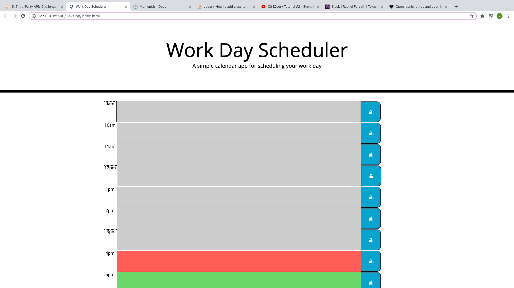
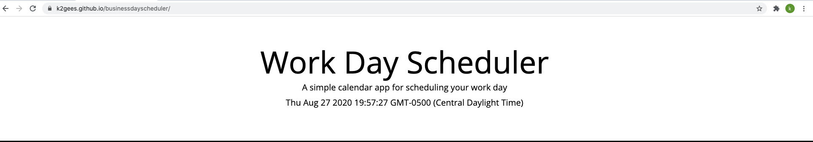
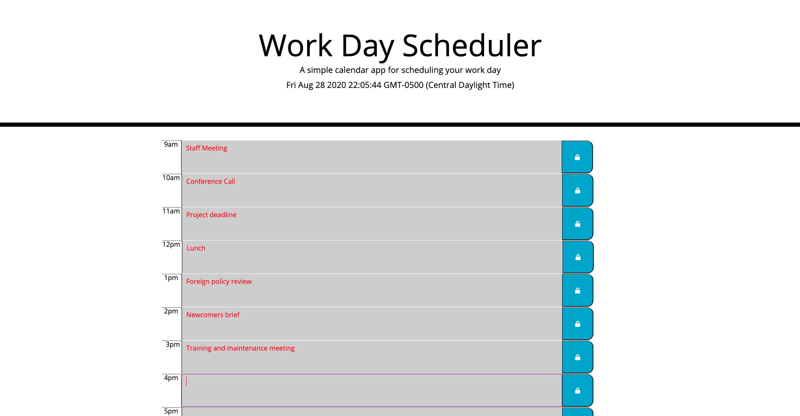

# Business Day Scheduler Code

## Purpose
To create a easy to use planner to help stramline schedule of events throughout the business day.  This will also track and save the user's input at the push of a button

## Built with
HTML
CSS
JQuery

## Website
https://github.com/K2gees/businessdayscheduler

https://k2gees.github.io/businessdayscheduler/

## Screenshots

### Closing
Our user interface is reactive to the user and provides immediate feedback.  This is a responsive tool that should be very easy froor the end user to navigate.  

